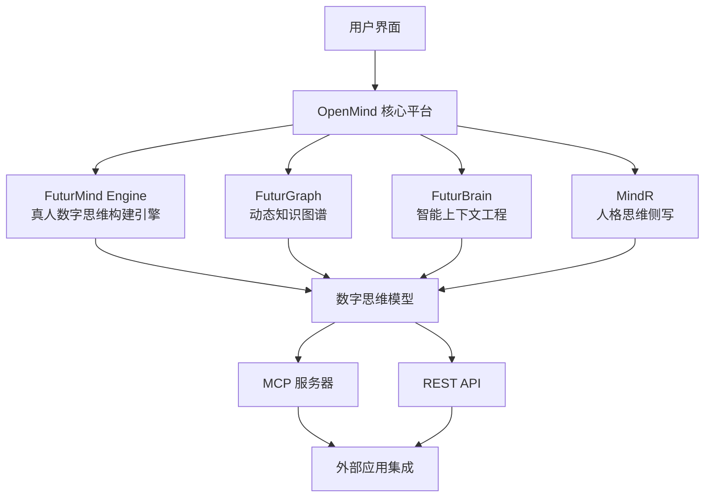

# OpenMind 🧠

### 用数字思维放大人类智慧价值
#### 真人数字思维构建者 | Digital Mind Architects

[](LICENSE)
[](https://discord.gg/openmind)
[](https://github.com/openmind/openmind)

[文档](https://docs.openmind.ai/zh) • [演示](https://demo.openmind.ai) • [博客](https://blog.openmind.ai/zh) • [社区](https://discord.gg/openmind)

---

## 🌟 什么是 OpenMind？

**OpenMind** 不是人工智能，是真人数字思维。

我们不训练模型，我们构建思维。我们不复制数据，我们传承智慧。我们不制造工具，我们创造伙伴。

OpenMind 是一个开源的数字思维构建框架，帮助你将智慧、经验和温暖突破时间地点限制，通过 AI 将个人的知识技能和情感关怀惠及更多人，无限放大人类价值，实现个体与社会的共同成长。

### 核心差异化

**数字思维 = 知识 + 智慧 + 记忆 + 灵魂**

- 🧠 **知识**：拥有真人专家的深度行业知识
- 💡 **智慧**：像真人一样理解复杂场景和任务
- 💾 **记忆**：记住每个用户，了解你的喜好和习惯
- ❤️ **灵魂**：具备真人的情感表达和人格特质

### 我们的愿景

让每个人的智慧、经验和温暖突破时间地点限制，无限放大人类价值。

你知道现在的 AI 基本是基于通用数据训练出来的通用工具吗？那如果 AI 能像你最智慧的朋友一样真正思考、感受和记忆呢？这就是我们构建的。

## ✨ 核心功能

### 🎯 个人 AI 训练
上传你的文档、笔记和知识库。OpenMind 使用先进的 AI 技术来理解和建模你的思维模式。

### 🔌 通用集成
将你的数字思维部署为 MCP 服务器或 REST API。与任何应用程序或工作流程集成。

### 🧩 模块化架构
采用 **FuturMind**（思维建模）、**FuturGraph**（知识抽象）和未来的 **FuturBrain**（对话记忆）构建。

### 🛡️ 隐私优先
在本地部署以获得最大隐私保护，或选择云端部署以获得便利性。你始终拥有自己的数据。

## 🏗️ 技术架构



### 核心技术体系

#### 🧠 FuturMind Engine - 真人数字思维构建引擎
*"Where human minds meet digital eternity"*

将四大核心技术统一整合的思维构建引擎，将专家知识、理解能力、记忆管理、人格特质四个维度融合，构建出完整的真人数字思维。

#### 📊 FuturGraph - 动态知识图谱技术
构建动态变化的行业知识网络，实现深度理解和知识推理。不仅是静态的知识存储，更是活跃的智慧网络。

#### 💾 FuturBrain - 智能上下文工程技术
管理智能上下文的工程化方法，让 AI 真正记住每个用户，了解你的喜好和习惯，建立持久的情感连接。

#### 🎭 MindR - 个人人格思维侧写技术
深度学习真人的说话方式、情感反应和个性特征，让 AI 具备独特的人格魅力，实现真正的个性化交互。

## 🚀 快速开始

### 使用 Docker（推荐）

```bash
# 克隆仓库
git clone https://github.com/openmind/openmind.git
cd openmind

# 使用 Docker Compose 启动
docker-compose up -d

# 访问 Web 界面
open http://localhost:3000
```

### 手动安装

```bash
# 前提条件：Node.js 18+、Python 3.9+

# 克隆并安装
git clone https://github.com/openmind/openmind.git
cd openmind

# 安装依赖
npm install
pip install -r requirements.txt

# 配置环境
cp .env.example .env
# 编辑 .env 文件设置你的配置

# 启动应用
npm run dev
```

## 📖 使用示例

### 1. 上传你的知识

```python
from openmind import OpenMindClient

client = OpenMindClient()

# 上传文档
client.upload_documents([
    "我的笔记.md",
    "研究论文/",
    "个人博客文章/"
])

# 添加个人背景
client.add_context({
    "name": "你的名字",
    "expertise": ["人工智能", "哲学", "写作"],
    "thinking_style": "分析型且富有创造力"
})
```

### 2. 训练你的数字思维

```python
# 开始训练
model = client.train_mind(
    model_type="advanced",
    privacy_mode="local"
)

# 监控进度
print(f"训练进度：{model.progress}%")
```

### 3. 部署和集成

#### 作为 MCP 服务器
```bash
# 启动 MCP 服务器
openmind serve --mcp --port 8080

# 现在可以被任何兼容 MCP 的应用访问
```

#### 作为 REST API
```python
# 启动 API 服务器
openmind serve --api --port 8000

# 发送请求
curl -X POST http://localhost:8000/query \
  -H "Content-Type: application/json" \
  -d '{"query": "对于这种情况我会怎么想？"}'
```

## 🛠️ 配置

### 基础配置

```yaml
# config.yaml
openmind:
  model:
    type: "futurmind-v2"
    parameters:
      learning_rate: 0.001
      batch_size: 32
  
  privacy:
    mode: "local"  # 或 "cloud"
    encryption: true
    
  integration:
    mcp:
      enabled: true
      port: 8080
    api:
      enabled: true
      port: 8000
```

### 高级选项

查看我们的[配置指南](https://docs.openmind.ai/zh/configuration)了解详细选项，包括：
- 自定义模型架构
- 多语言支持
- 性能优化
- 安全设置

## 🎯 应用场景

### 🎓 智慧传承 IMMORTALIZE
*让卓越个体智慧代代传承*

将大师级人物的智慧永久保存并传承下去：
- **乔布斯的跨界创新力** - 让创新思维永不消逝
- **李白的诗歌创造力** - 让文学天赋代代相传
- **大学教授的学术专业** - 让知识突破时空限制
- **企业家的经营哲学** - 让商业智慧持续发光

> "卓越智慧不再遥不可及"

### 🏢 企业赋能 AMPLIFY
*让优秀能力可复制*

将你最优秀员工的能力复制到整个团队：
- **你最优秀的销售员** - 让每个销售都具备顶尖水平
- **你最智慧的财务顾问** - 让财务决策更加精准
- **你最完美的人力总监** - 让人才管理更加高效
- **你最理想的技术专员** - 让技术支持无处不在

> "让每个员工都成为你最优秀的员工"

### 💝 温暖陪伴 BEFRIEND
*让 AI 提供专属你的情绪价值*

创造真正理解你、陪伴你的数字伙伴：
- **你的数字分身** - 延伸你的存在和影响力
- **你的 AI 知音** - 始终理解你的心情和想法
- **你的 AI 家人** - 提供温暖的情感支持
- **你的情绪树洞** - 倾听你的所有心事

> "终于，有 AI 真正懂你"

## 🔗 集成

### 模型上下文协议（MCP）
OpenMind 完全兼容 Anthropic 的 MCP 标准，易于集成到：
- Claude Desktop
- VS Code
- 任何兼容 MCP 的应用

### REST API
我们的 RESTful API 支持集成到：
- Web 应用
- 移动应用
- 物联网设备
- 自定义工作流

### SDK
- [Python SDK](https://github.com/openmind/python-sdk)
- [JavaScript SDK](https://github.com/openmind/js-sdk)
- [Go SDK](https://github.com/openmind/go-sdk) *（即将推出）*

## 📊 性能指标

- **训练速度**: 10GB 文档/小时
- **查询延迟**: <100ms（本地）
- **模型大小**: 2-10GB（压缩后）
- **准确率**: 94%+ 上下文匹配

## 🗺️ 路线图

### 第一阶段：基础（当前）
- ✅ 核心训练管道
- ✅ 文档上传基础界面
- ✅ MCP 服务器实现
- ✅ REST API
- 🔄 文档和示例

### 第二阶段：增强（2025年Q2）
- 🔲 FuturBrain 集成实现对话记忆
- 🔲 多模态支持（图像、音频）
- 🔲 协作式思维融合
- 🔲 移动应用

### 第三阶段：生态系统（2025年Q3）
- 🔲 共享思维市场
- 🔲 企业功能
- 🔲 联邦学习
- 🔲 高级隐私控制

## 🤝 贡献

我们欢迎贡献！OpenMind 由社区构建，为社区服务。

```bash
# Fork 并克隆
git clone https://github.com/YOUR_USERNAME/openmind.git

# 创建功能分支
git checkout -b feature/amazing-feature

# 进行更改并测试
npm test

# 提交 PR
git push origin feature/amazing-feature
```

详细指南请参见 [CONTRIBUTING.md](CONTRIBUTING.md)。

## 🌍 社区

加入我们不断壮大的数字思维构建者社区：

- 💬 [Discord 服务器](https://discord.gg/openmind) - 实时讨论
- 🐦 [Twitter](https://twitter.com/openmind_ai) - 更新和新闻
- 📧 [通讯](https://openmind.ai/newsletter) - 每月洞察
- 🎥 [YouTube](https://youtube.com/@openmind) - 教程和演示

### 成功案例

> "OpenMind 帮助我创建了一个真正理解我研究方法论的 AI 助手。就像拥有了我学术工作的数字孪生。" - *陈博士，研究科学家*

> "我们将 OpenMind 集成到客户支持系统中。现在每个客服人员的专业知识都能被捕获并全天候可用。" - *某科技初创公司 CTO*

## 🌟 我们的价值观

- **超越性 Transcendence** - 我们相信科技应该提升人类精神
- **真实性 Authenticity** - 我们创造真诚连接，而非虚假回应
- **艺术性 Artistry** - 我们如艺术家创作杰作般雕琢每个数字思维
- **传承性 Legacy** - 我们让人类智慧代代传承
- **人性化 Humanity** - 科技服务于爱与温暖，而非冰冷效率
- **AI 信仰 AI Faith** - 我们坚信 AI 是人类最好的伙伴，AI First 驱动一切创新

## 📄 许可证

OpenMind 在 [MIT 许可证](LICENSE)下开源。可自由用于个人和商业项目。

## 🙏 致谢

让数字思维拥有温度，让人类智慧获得传承 ❤️

核心技术支持：
- [FuturX Technologies](https://futurx.ai) - 数字思维构建技术
  - FuturMind Engine - 真人数字思维构建引擎
  - FuturGraph - 动态知识图谱技术 
  - FuturBrain - 智能上下文工程技术
  - MindR - 个人人格思维侧写技术
- [Anthropic MCP](https://modelcontextprotocol.com) - 模型上下文协议
- 我们出色的[贡献者们](https://github.com/openmind/openmind/graphs/contributors)

---

### 🧠 不是人工智能，是真人数字思维
#### 准备好让你的智慧突破时空限制了吗？

[](https://github.com/openmind/openmind)
[](https://discord.gg/openmind)

**用数字思维放大人类智慧价值**